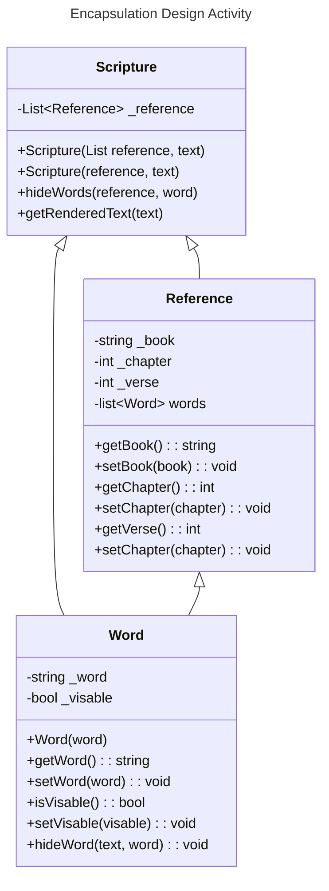

```mermaid
---
title:  Encapsulation Design Activity
---
classDiagram
    class Scripture{
        -List~Reference~ _reference

        +Scripture(List reference, text)
        +Scripture(reference, text)

        +hideWords(reference, word)
        +getRenderedText(text)

    }

    class Reference{
        -string _book
        -int _chapter
        -int _verse
        -list~Word~ words

        +getBook() : string
        +setBook(book) : void
        +getChapter() : int
        +setChapter(chapter) : void
        +getVerse() : int
        +setChapter(chapter) : void
    }

    class Word{
        -string _word
        -bool _visable

        +Word(word)
        +getWord() : string
        +setWord(word) : void
        +isVisable() : bool
        +setVisable(visable) : void
        +hideWord(text, word) : void
    }

    Scripture <|-- Reference
    Scripture <|-- Word
    Reference <|-- Word
```
